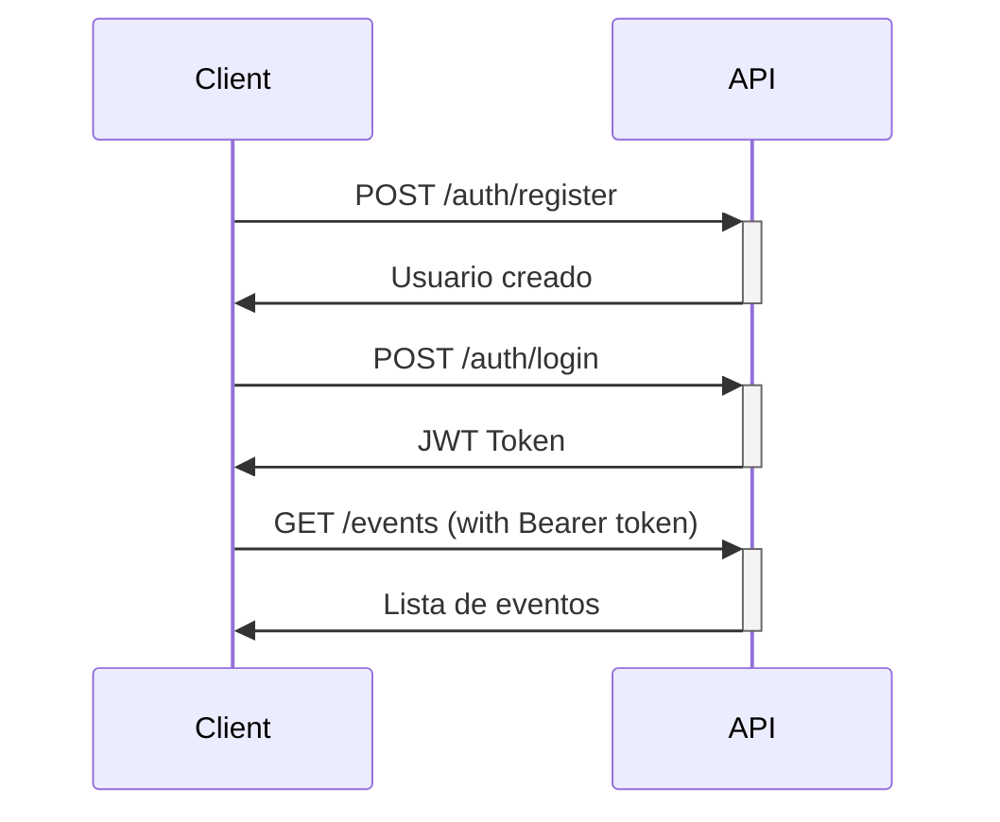

# 🔌 Documentación de API - Cal Backend v3

> **Documentación completa de endpoints, autenticación y ejemplos de uso**

## 📋 Tabla de Contenidos

1. [Información General](#-información-general)
2. [Autenticación](#-autenticación)
3. [Endpoints de Usuarios](#-endpoints-de-usuarios)
4. [Endpoints de Eventos](#-endpoints-de-eventos)
5. [Endpoints de Horarios](#-endpoints-de-horarios)
6. [Endpoints de Reuniones](#-endpoints-de-reuniones)
7. [Endpoints de Integración OAuth](#-endpoints-de-integración-oauth)
8. [Endpoints de Calendarios](#-endpoints-de-calendarios)
9. [Códigos de Estado](#-códigos-de-estado)
10. [Ejemplos de Uso](#-ejemplos-de-uso)

## 📌 Información General

### Base URL
```
http://localhost:8000/api/v1
```

### Formato de Datos
- **Request**: JSON
- **Response**: JSON
- **Content-Type**: `application/json`
- **Charset**: UTF-8

### Versionado
- **Versión actual**: v1
- **Esquema**: `/api/v{número}`

### Zona Horaria
- **Por defecto**: UTC
- **Formato**: ISO 8601 (`YYYY-MM-DDTHH:mm:ss.sssZ`)
- **Soporte**: IANA timezone names

## 🔐 Autenticación

### Tipos de Autenticación

#### 1. JWT Bearer Token
```http
Authorization: Bearer <jwt_token>
```

#### 2. OAuth2 (Google)
Usado para integración con Google Calendar.

### Flujo de Autenticación



## 👤 Endpoints de Usuarios

### Registro de Usuario

```http
POST /auth/register
```

**Body:**
```json
{
  "email": "usuario@ejemplo.com",
  "password": "password123",
  "firstName": "Juan",
  "lastName": "Pérez",
  "timezone": "America/Mexico_City"
}
```

**Response:**
```json
{
  "success": true,
  "data": {
    "id": "uuid-123",
    "email": "usuario@ejemplo.com",
    "username": "juan-perez-123",
    "firstName": "Juan",
    "lastName": "Pérez",
    "timezone": "America/Mexico_City",
    "createdAt": "2025-06-17T12:00:00.000Z"
  },
  "message": "Usuario registrado exitosamente"
}
```

### Login de Usuario

```http
POST /auth/login
```

**Body:**
```json
{
  "email": "usuario@ejemplo.com",
  "password": "password123"
}
```

**Response:**
```json
{
  "success": true,
  "data": {
    "user": {
      "id": "uuid-123",
      "email": "usuario@ejemplo.com",
      "username": "juan-perez-123",
      "firstName": "Juan",
      "lastName": "Pérez"
    },
    "token": "eyJhbGciOiJIUzI1NiIsInR5cCI6IkpXVCJ9...",
    "expiresIn": "7d"
  },
  "message": "Login exitoso"
}
```

### Obtener Perfil de Usuario

```http
GET /auth/profile
Authorization: Bearer <token>
```

**Response:**
```json
{
  "success": true,
  "data": {
    "id": "uuid-123",
    "email": "usuario@ejemplo.com",
    "username": "juan-perez-123",
    "firstName": "Juan",
    "lastName": "Pérez",
    "timezone": "America/Mexico_City",
    "isGoogleConnected": true,
    "createdAt": "2025-06-17T12:00:00.000Z",
    "updatedAt": "2025-06-17T12:00:00.000Z"
  }
}
```

### Actualizar Perfil

```http
PUT /auth/profile
Authorization: Bearer <token>
```

**Body:**
```json
{
  "firstName": "Juan Carlos",
  "lastName": "Pérez García",
  "timezone": "America/New_York"
}
```

## 📅 Endpoints de Eventos

### Listar Eventos del Usuario

```http
GET /events
Authorization: Bearer <token>
```

**Query Parameters:**
- `page` (number): Página (default: 1)
- `limit` (number): Elementos por página (default: 10)
- `isActive` (boolean): Solo eventos activos
- `privacy` (string): `public` | `private`

**Response:**
```json
{
  "success": true,
  "data": {
    "events": [
      {
        "id": "uuid-456",
        "title": "Reunión de 30 minutos",
        "slug": "reunion-30-minutos",
        "description": "Reunión para discutir proyectos",
        "duration": 30,
        "privacy": "public",
        "locationType": "google_meet",
        "isActive": true,
        "calendarId": "primary",
        "createdAt": "2025-06-17T12:00:00.000Z"
      }
    ],
    "pagination": {
      "page": 1,
      "limit": 10,
      "total": 1,
      "totalPages": 1
    }
  }
}
```

### Crear Evento

```http
POST /events
Authorization: Bearer <token>
```

**Body:**
```json
{
  "title": "Consulta de 45 minutos",
  "description": "Consulta personalizada",
  "duration": 45,
  "privacy": "public",
  "locationType": "google_meet",
  "calendarId": "calendar-specific-id"
}
```

**Response:**
```json
{
  "success": true,
  "data": {
    "id": "uuid-789",
    "title": "Consulta de 45 minutos",
    "slug": "consulta-45-minutos",
    "description": "Consulta personalizada",
    "duration": 45,
    "privacy": "public",
    "locationType": "google_meet",
    "calendarId": "calendar-specific-id",
    "isActive": true,
    "publicUrl": "http://localhost:8000/book/juan-perez-123/consulta-45-minutos",
    "createdAt": "2025-06-17T12:00:00.000Z"
  },
  "message": "Evento creado exitosamente"
}
```

### Obtener Evento por ID

```http
GET /events/{eventId}
Authorization: Bearer <token>
```

### Obtener Evento Público por Slug

```http
GET /public/events/{username}/{slug}
```

**Response:**
```json
{
  "success": true,
  "data": {
    "id": "uuid-789",
    "title": "Consulta de 45 minutos",
    "description": "Consulta personalizada",
    "duration": 45,
    "locationType": "google_meet",
    "user": {
      "firstName": "Juan",
      "lastName": "Pérez",
      "username": "juan-perez-123"
    }
  }
}
```

### Actualizar Evento

```http
PUT /events/{eventId}
Authorization: Bearer <token>
```

### Eliminar Evento

```http
DELETE /events/{eventId}
Authorization: Bearer <token>
```

## ⏰ Endpoints de Horarios

### Obtener Horarios de Usuario

```http
GET /schedules
Authorization: Bearer <token>
```

**Response:**
```json
{
  "success": true,
  "data": {
    "schedules": [
      {
        "id": "uuid-schedule",
        "dayOfWeek": 1,
        "startTime": "09:00",
        "endTime": "17:00",
        "isAvailable": true,
        "bufferTime": 15
      }
    ]
  }
}
```

### Crear/Actualizar Horario

```http
POST /schedules
Authorization: Bearer <token>
```

**Body:**
```json
{
  "schedules": [
    {
      "dayOfWeek": 1,
      "startTime": "09:00",
      "endTime": "17:00",
      "isAvailable": true,
      "bufferTime": 15
    },
    {
      "dayOfWeek": 2,
      "startTime": "10:00",
      "endTime": "16:00",
      "isAvailable": true,
      "bufferTime": 10
    }
  ]
}
```

### Obtener Slots Disponibles

```http
GET /public/availability/{username}/{eventSlug}
```

**Query Parameters:**
- `date` (string): Fecha en formato YYYY-MM-DD
- `timezone` (string): Zona horaria IANA

**Response:**
```json
{
  "success": true,
  "data": {
    "date": "2025-06-17",
    "timezone": "America/Mexico_City",
    "slots": [
      {
        "startTime": "2025-06-17T09:00:00.000Z",
        "endTime": "2025-06-17T09:45:00.000Z",
        "available": true
      },
      {
        "startTime": "2025-06-17T10:00:00.000Z",
        "endTime": "2025-06-17T10:45:00.000Z",
        "available": true
      }
    ]
  }
}
```

## 📋 Endpoints de Reuniones

### Programar Reunión

```http
POST /public/meetings/{username}/{eventSlug}
```

**Body:**
```json
{
  "startTime": "2025-06-17T09:00:00.000Z",
  "endTime": "2025-06-17T09:45:00.000Z",
  "attendee": {
    "name": "María García",
    "email": "maria@ejemplo.com",
    "timezone": "America/Mexico_City"
  },
  "notes": "Reunión para discutir el proyecto X"
}
```

**Response:**
```json
{
  "success": true,
  "data": {
    "id": "uuid-meeting",
    "startTime": "2025-06-17T09:00:00.000Z",
    "endTime": "2025-06-17T09:45:00.000Z",
    "status": "scheduled",
    "attendee": {
      "name": "María García",
      "email": "maria@ejemplo.com"
    },
    "meetingUrl": "https://meet.google.com/abc-defg-hij",
    "calendarEventId": "google-calendar-event-id"
  },
  "message": "Reunión programada exitosamente"
}
```

### Listar Reuniones del Usuario

```http
GET /meetings
Authorization: Bearer <token>
```

**Query Parameters:**
- `status` (string): `scheduled` | `cancelled` | `completed`
- `page` (number)
- `limit` (number)
- `startDate` (string): Filtrar desde fecha
- `endDate` (string): Filtrar hasta fecha

**Response:**
```json
{
  "success": true,
  "data": {
    "meetings": [
      {
        "id": "uuid-meeting",
        "startTime": "2025-06-17T09:00:00.000Z",
        "endTime": "2025-06-17T09:45:00.000Z",
        "status": "scheduled",
        "attendee": {
          "name": "María García",
          "email": "maria@ejemplo.com"
        },
        "event": {
          "title": "Consulta de 45 minutos",
          "slug": "consulta-45-minutos"
        },
        "meetingUrl": "https://meet.google.com/abc-defg-hij"
      }
    ],
    "pagination": {
      "page": 1,
      "limit": 10,
      "total": 1,
      "totalPages": 1
    }
  }
}
```

### Cancelar Reunión

```http
DELETE /meetings/{meetingId}
Authorization: Bearer <token>
```

**Response:**
```json
{
  "success": true,
  "message": "Reunión cancelada exitosamente"
}
```

## 🔗 Endpoints de Integración OAuth

### Obtener URL de Autorización de Google

```http
GET /auth/google
Authorization: Bearer <token>
```

**Response:**
```json
{
  "success": true,
  "data": {
    "authUrl": "https://accounts.google.com/oauth/authorize?client_id=..."
  }
}
```

### Callback de OAuth (Manejo automático)

```http
GET /auth/google/callback?code=authorization_code&state=user_id
```

### Verificar Estado de Conexión

```http
GET /auth/integrations
Authorization: Bearer <token>
```

**Response:**
```json
{
  "success": true,
  "data": {
    "google": {
      "connected": true,
      "email": "usuario@gmail.com",
      "connectedAt": "2025-06-17T12:00:00.000Z"
    },
    "zoom": {
      "connected": false
    },
    "microsoft": {
      "connected": false
    }
  }
}
```

### Desconectar Integración

```http
DELETE /auth/integrations/google
Authorization: Bearer <token>
```

## 📅 Endpoints de Calendarios

### Listar Calendarios de Google

```http
GET /calendars
Authorization: Bearer <token>
```

**Response:**
```json
{
  "success": true,
  "data": {
    "calendars": [
      {
        "id": "primary",
        "name": "Personal",
        "description": "Calendario principal",
        "isPrimary": true,
        "accessRole": "owner"
      },
      {
        "id": "calendar-id-2",
        "name": "Trabajo",
        "description": "Calendario de trabajo",
        "isPrimary": false,
        "accessRole": "owner"
      }
    ]
  }
}
```

### Seleccionar Calendario por Defecto

```http
PUT /calendars/default
Authorization: Bearer <token>
```

**Body:**
```json
{
  "calendarId": "calendar-id-2"
}
```

## 🔍 Endpoints de Utilidad

### Health Check

```http
GET /health
```

**Response:**
```json
{
  "status": "ok",
  "timestamp": "2025-06-17T12:00:00.000Z",
  "version": "3.0.0",
  "environment": "development"
}
```

### Información de la API

```http
GET /info
```

**Response:**
```json
{
  "name": "Cal Backend API",
  "version": "3.0.0",
  "description": "Sistema de gestión de calendarios",
  "documentation": "/api/v1/docs"
}
```

## 📊 Códigos de Estado

### Códigos de Éxito

| Código | Significado | Uso |
|--------|-------------|-----|
| `200` | OK | Operación exitosa |
| `201` | Created | Recurso creado exitosamente |
| `204` | No Content | Eliminación exitosa |

### Códigos de Error del Cliente

| Código | Significado | Descripción |
|--------|-------------|-------------|
| `400` | Bad Request | Datos de entrada inválidos |
| `401` | Unauthorized | Token inválido o ausente |
| `403` | Forbidden | Sin permisos para el recurso |
| `404` | Not Found | Recurso no encontrado |
| `409` | Conflict | Conflicto con estado actual |
| `422` | Unprocessable Entity | Errores de validación |
| `429` | Too Many Requests | Límite de rate exceeded |

### Códigos de Error del Servidor

| Código | Significado | Descripción |
|--------|-------------|-------------|
| `500` | Internal Server Error | Error interno del servidor |
| `502` | Bad Gateway | Error de integración externa |
| `503` | Service Unavailable | Servicio temporalmente no disponible |

### Formato de Respuesta de Error

```json
{
  "success": false,
  "error": {
    "code": "VALIDATION_ERROR",
    "message": "Los datos proporcionados no son válidos",
    "details": [
      {
        "field": "email",
        "message": "Email debe ser una dirección válida"
      }
    ]
  },
  "timestamp": "2025-06-17T12:00:00.000Z"
}
```

## 💡 Ejemplos de Uso

### Ejemplo 1: Flujo Completo de Registro y Creación de Evento

```bash
# 1. Registrar usuario
curl -X POST http://localhost:8000/api/v1/auth/register \
  -H "Content-Type: application/json" \
  -d '{
    "email": "juan@ejemplo.com",
    "password": "password123",
    "firstName": "Juan",
    "lastName": "Pérez"
  }'

# 2. Login
curl -X POST http://localhost:8000/api/v1/auth/login \
  -H "Content-Type: application/json" \
  -d '{
    "email": "juan@ejemplo.com",
    "password": "password123"
  }'

# 3. Crear evento (usar token obtenido en step 2)
curl -X POST http://localhost:8000/api/v1/events \
  -H "Content-Type: application/json" \
  -H "Authorization: Bearer YOUR_JWT_TOKEN" \
  -d '{
    "title": "Reunión de 30 minutos",
    "description": "Reunión para discutir proyectos",
    "duration": 30,
    "privacy": "public",
    "locationType": "google_meet"
  }'
```

### Ejemplo 2: Programar una Reunión

```bash
# 1. Verificar disponibilidad
curl "http://localhost:8000/api/v1/public/availability/juan-perez-123/reunion-30-minutos?date=2025-06-17&timezone=America/Mexico_City"

# 2. Programar reunión
curl -X POST http://localhost:8000/api/v1/public/meetings/juan-perez-123/reunion-30-minutos \
  -H "Content-Type: application/json" \
  -d '{
    "startTime": "2025-06-17T09:00:00.000Z",
    "endTime": "2025-06-17T09:30:00.000Z",
    "attendee": {
      "name": "María García",
      "email": "maria@ejemplo.com",
      "timezone": "America/Mexico_City"
    },
    "notes": "Reunión para discutir el proyecto X"
  }'
```

### Ejemplo 3: Configurar Horarios

```bash
# Configurar horarios de trabajo
curl -X POST http://localhost:8000/api/v1/schedules \
  -H "Content-Type: application/json" \
  -H "Authorization: Bearer YOUR_JWT_TOKEN" \
  -d '{
    "schedules": [
      {
        "dayOfWeek": 1,
        "startTime": "09:00",
        "endTime": "17:00",
        "isAvailable": true,
        "bufferTime": 15
      },
      {
        "dayOfWeek": 2,
        "startTime": "09:00",
        "endTime": "17:00",
        "isAvailable": true,
        "bufferTime": 15
      }
    ]
  }'
```

## 📝 Rate Limiting

- **Límite general**: 100 requests por minuto por IP
- **Autenticación**: 10 intentos por minuto por IP
- **Headers de respuesta**:
  ```
  X-RateLimit-Limit: 100
  X-RateLimit-Remaining: 95
  X-RateLimit-Reset: 1624363200
  ```

## 🔒 Seguridad

### Headers de Seguridad

```http
Content-Security-Policy: default-src 'self'
X-Frame-Options: DENY
X-Content-Type-Options: nosniff
Referrer-Policy: strict-origin-when-cross-origin
```

### Validación de Entrada

- Todos los endpoints validan entrada usando **class-validator**
- Sanitización automática de datos
- Validación de tipos TypeScript

### Autenticación JWT

- **Algoritmo**: HS256
- **Expiración**: Configurable (default: 7 días)
- **Refresh**: Automático con Google OAuth

---

**📖 Para más ejemplos y casos de uso**, consulta el [README Funcional](FUNCTIONAL_README.md).

*Última actualización: Junio 2025*