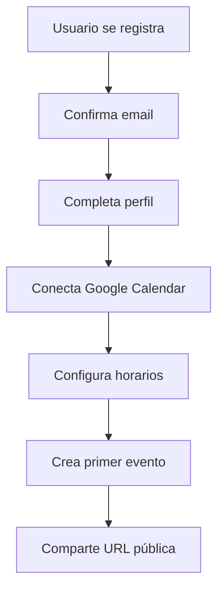
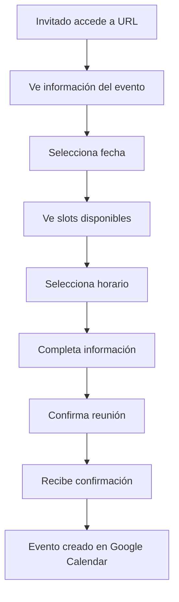
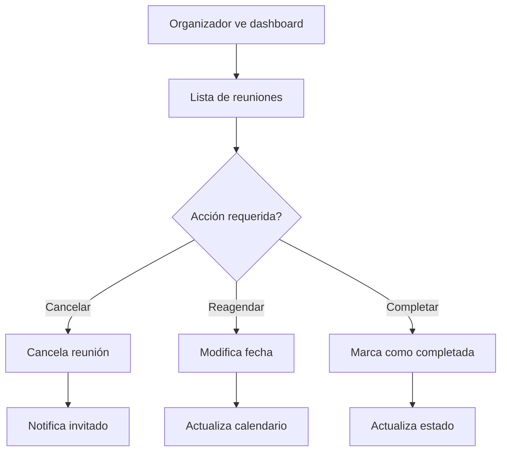
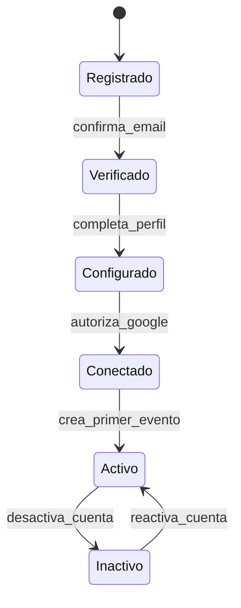
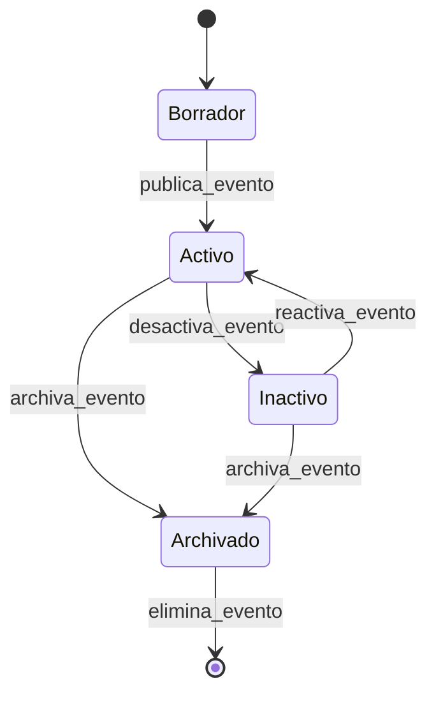
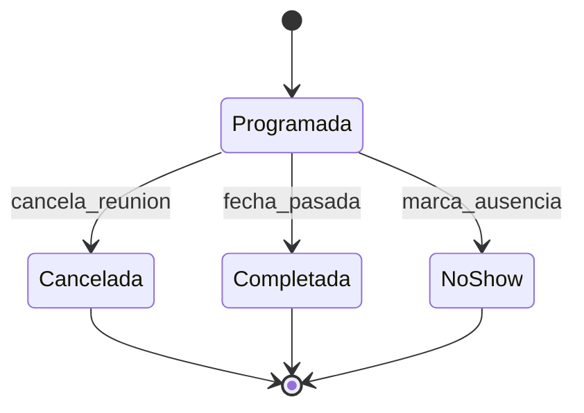

# ⚡ README Funcional - Cal Backend v3

> **Guía completa de funcionalidades, casos de uso y flujos de trabajo**

## 📋 Tabla de Contenidos

1. [Visión General del Sistema](#-visión-general-del-sistema)
2. [Funcionalidades Principales](#-funcionalidades-principales)
3. [Flujos de Trabajo](#-flujos-de-trabajo)
4. [Casos de Uso Detallados](#-casos-de-uso-detallados)
5. [Integración con Google](#-integración-con-google)
6. [Gestión de Calendarios Específicos](#-gestión-de-calendarios-específicos)
7. [Manejo de Zonas Horarias](#-manejo-de-zonas-horarias)
8. [Estados y Transiciones](#-estados-y-transiciones)
9. [Reglas de Negocio](#-reglas-de-negocio)
10. [Escenarios Avanzados](#-escenarios-avanzados)

## 🎯 Visión General del Sistema

Cal Backend v3 es un **sistema completo de gestión de calendarios** diseñado para automatizar la programación de reuniones, similar a **Calendly**. El sistema permite a los usuarios crear tipos de eventos personalizados, gestionar su disponibilidad y programar reuniones automáticamente con integración completa a Google Calendar.

### 🎨 Filosofía de Diseño

- **Simplicidad**: Interfaz intuitiva tanto para organizadores como invitados
- **Flexibilidad**: Configuración granular de horarios y tipos de eventos
- **Automatización**: Mínima intervención manual en el proceso de programación
- **Integración**: Sincronización bidireccional con calendarios externos
- **Escalabilidad**: Arquitectura preparada para múltiples usuarios y eventos

## 🚀 Funcionalidades Principales

### 1. 👤 Gestión de Usuarios

#### Registro y Autenticación
- **Registro completo** con validación de email único
- **Generación automática de username** basado en nombre y apellido
- **Autenticación JWT** con tokens de larga duración
- **Hash seguro de contraseñas** con bcrypt y salt
- **Validación robusta** de datos de entrada

#### Perfil de Usuario
- **Información personal**: Nombre, apellido, email, zona horaria
- **Configuraciones**: Zona horaria por defecto, idioma preferido
- **Estado de integraciones**: Google Calendar, Zoom, Microsoft (preparado)
- **URLs públicas**: Username único para compartir eventos

### 2. 📅 Gestión de Eventos (Event Types)

#### Creación de Tipos de Eventos
- **Título y descripción** personalizables
- **Duración variable**: Desde 15 minutos hasta varias horas
- **Privacidad configurable**: Público o privado
- **Tipos de ubicación**: Google Meet, Zoom, presencial, personalizado
- **URLs amigables**: Slugs únicos generados automáticamente

#### Configuración Avanzada
- **Calendario específico**: Asignación a calendarios particulares de Google
- **Buffer time**: Tiempo entre reuniones para preparación
- **Horarios personalizados**: Por tipo de evento si es necesario
- **Preguntas personalizadas**: Para recopilar información adicional

#### Estados de Eventos
- **Activo/Inactivo**: Control de disponibilidad pública
- **Archivado**: Mantener historial sin mostrar públicamente
- **Eliminación en cascada**: Al eliminar, cancela reuniones programadas

### 3. ⏰ Gestión de Horarios

#### Configuración de Disponibilidad
- **Por día de la semana**: Configuración independiente para cada día
- **Horarios flexibles**: Múltiples bloques de tiempo por día
- **Zonas horarias**: Soporte completo IANA con conversión automática
- **Buffer time**: Tiempo de preparación entre reuniones
- **Días no disponibles**: Configuración de días libres o vacaciones

#### Cálculo de Slots Disponibles
- **Algoritmo inteligente** que considera:
  - Horarios configurados por el usuario
  - Reuniones ya programadas
  - Buffer time entre eventos
  - Duración del tipo de evento
  - Zona horaria del invitado

#### Manejo de Excepciones
- **Días específicos**: Sobrescribir horarios para fechas particulares
- **Vacaciones**: Bloqueo de períodos completos
- **Eventos externos**: Integración con calendario de Google para evitar conflictos

### 4. 📋 Gestión de Reuniones

#### Programación de Reuniones
- **Interfaz pública**: Sin necesidad de autenticación para invitados
- **Validación en tiempo real**: Verificación de disponibilidad al programar
- **Información del invitado**: Nombre, email, zona horaria, notas
- **Creación automática**: Event en Google Calendar con detalles completos
- **Enlaces de reunión**: Generación automática de Google Meet

#### Estados de Reuniones
- **Programada (scheduled)**: Reunión confirmada y creada en calendario
- **Cancelada (cancelled)**: Reunión cancelada, removida del calendario
- **Completada (completed)**: Reunión finalizada (automático después de la fecha)
- **No presentado (no_show)**: Marcado manualmente si el invitado no asiste

#### Notificaciones y Recordatorios
- **Email de confirmación**: Automático al programar
- **Recordatorios**: 24 horas y 1 hora antes (configurado en Google Calendar)
- **Cancelación**: Notificación automática a ambas partes
- **Información de acceso**: Enlaces de Google Meet incluidos

### 5. 🔗 Integraciones Externas

#### Google Calendar Integration
- **OAuth2 completo**: Autorización segura con scopes específicos
- **Calendarios múltiples**: Acceso a todos los calendarios del usuario
- **Sincronización bidireccional**: Crear y eliminar eventos
- **Refresh automático**: Gestión transparente de tokens
- **Manejo de errores**: Reconexión automática en caso de problemas

#### Google Meet Integration
- **Enlaces automáticos**: Generación de links únicos para cada reunión
- **Configuración automática**: Añadido a eventos de Google Calendar
- **Acceso directo**: URLs incluidas en emails de confirmación

#### Preparado para Futuras Integraciones
- **Zoom**: Estructura preparada para integración
- **Microsoft Teams**: OAuth y endpoints listos
- **Outlook Calendar**: Compatibilidad planificada

## 🔄 Flujos de Trabajo

### Flujo 1: Registro y Configuración Inicial



**Pasos detallados:**

1. **Registro**: Email, contraseña, nombre, apellido
2. **Perfil**: Zona horaria, configuraciones personales
3. **OAuth Google**: Autorización para Calendar y Meet
4. **Horarios**: Configuración de disponibilidad semanal
5. **Primer evento**: Creación de tipo de evento básico
6. **Compartir**: URL pública lista para usar

### Flujo 2: Programación de Reunión por Invitado



**Pasos detallados:**

1. **Acceso público**: Sin autenticación requerida
2. **Información**: Descripción del evento, duración, tipo
3. **Calendario**: Interfaz de selección de fecha
4. **Slots**: Horarios disponibles en zona horaria del invitado
5. **Datos**: Nombre, email, zona horaria, notas opcionales
6. **Confirmación**: Validación final y programación
7. **Notificación**: Email automático con detalles
8. **Sincronización**: Creación en Google Calendar del organizador

### Flujo 3: Gestión de Reuniones por Organizador



## 📖 Casos de Uso Detallados

### Caso 1: Consultor Freelance

**Personaje**: María, consultora de marketing digital

**Necesidades**:
- Reuniones de 30 minutos con clientes potenciales
- Consultas de 60 minutos con clientes existentes
- Horarios flexibles con algunos días libres
- Integración con su calendario personal

**Configuración**:
```json
{
  "eventos": [
    {
      "titulo": "Consulta Inicial Gratuita",
      "duracion": 30,
      "descripcion": "Reunión para conocer tus necesidades de marketing",
      "privacidad": "publico",
      "calendario": "trabajo@gmail.com"
    },
    {
      "titulo": "Sesión de Consultoría",
      "duracion": 60,
      "descripcion": "Consultoría estratégica personalizada",
      "privacidad": "publico",
      "calendario": "trabajo@gmail.com"
    }
  ],
  "horarios": {
    "lunes": { "inicio": "09:00", "fin": "17:00", "buffer": 15 },
    "martes": { "inicio": "09:00", "fin": "17:00", "buffer": 15 },
    "miercoles": { "disponible": false },
    "jueves": { "inicio": "10:00", "fin": "16:00", "buffer": 15 },
    "viernes": { "inicio": "09:00", "fin": "15:00", "buffer": 15 }
  }
}
```

**URLs compartidas**:
- `cal.empresa.com/maria-garcia/consulta-inicial-gratuita`
- `cal.empresa.com/maria-garcia/sesion-consultoria`

### Caso 2: Equipo de Ventas

**Personaje**: Equipo de ventas de software B2B

**Necesidades**:
- Demos de producto de 45 minutos
- Llamadas de seguimiento de 30 minutos
- Múltiples representantes con horarios diferentes
- Integración con CRM (futuro)

**Configuración por representante**:
```json
{
  "eventos_compartidos": [
    {
      "titulo": "Demo del Producto",
      "duracion": 45,
      "descripcion": "Demostración personalizada de nuestra plataforma",
      "preguntas": [
        "Tamaño de su empresa",
        "Presupuesto aproximado",
        "Urgencia de implementación"
      ]
    }
  ]
}
```

### Caso 3: Centro Médico

**Personaje**: Clínica médica con múltiples especialistas

**Necesidades**:
- Citas de diferentes duraciones según especialidad
- Horarios específicos por doctor
- Salas de consulta específicas
- Integración con sistema de historiales

**Configuración**:
```json
{
  "doctores": [
    {
      "nombre": "Dr. García - Medicina General",
      "eventos": [
        {
          "titulo": "Consulta General",
          "duracion": 30,
          "ubicacion": "Consultorio 1",
          "calendario": "consultorio1@clinica.com"
        }
      ]
    },
    {
      "nombre": "Dra. López - Cardiología",
      "eventos": [
        {
          "titulo": "Consulta Cardiológica",
          "duracion": 45,
          "ubicacion": "Consultorio 3",
          "calendario": "cardio@clinica.com"
        }
      ]
    }
  ]
}
```

## 🔗 Integración con Google

### Configuración OAuth2

#### Scopes Requeridos
```javascript
const GOOGLE_SCOPES = [
  'https://www.googleapis.com/auth/calendar',
  'https://www.googleapis.com/auth/calendar.events'
];
```

#### Flujo de Autorización
1. **Redirect a Google**: Usuario autoriza acceso a calendarios
2. **Callback handling**: Intercambio de código por tokens
3. **Almacenamiento seguro**: Tokens encriptados en base de datos
4. **Refresh automático**: Renovación transparente de access tokens

### Gestión de Calendarios

#### Listado de Calendarios
```javascript
// Ejemplo de respuesta de Google Calendar API
{
  "calendars": [
    {
      "id": "primary",
      "summary": "Personal",
      "description": "Calendario principal",
      "accessRole": "owner",
      "primary": true
    },
    {
      "id": "trabajo@empresa.com",
      "summary": "Trabajo",
      "description": "Calendario corporativo",
      "accessRole": "owner",
      "primary": false
    }
  ]
}
```

#### Creación de Eventos
```javascript
// Estructura de evento creado en Google Calendar
{
  "summary": "Consulta de 30 minutos - María García",
  "description": "Reunión programada a través de Cal Backend\n\nNotas del invitado: Necesito ayuda con estrategia de redes sociales",
  "start": {
    "dateTime": "2025-06-17T09:00:00-06:00",
    "timeZone": "America/Mexico_City"
  },
  "end": {
    "dateTime": "2025-06-17T09:30:00-06:00",
    "timeZone": "America/Mexico_City"
  },
  "attendees": [
    {
      "email": "invitado@ejemplo.com",
      "displayName": "María García",
      "responseStatus": "accepted"
    }
  ],
  "conferenceData": {
    "createRequest": {
      "requestId": "unique-request-id"
    }
  }
}
```

## 📅 Gestión de Calendarios Específicos

### Problema Resuelto en v3

**Antes (v2)**: Todos los eventos se creaban en el calendario "primary"
**Ahora (v3)**: Cada tipo de evento puede asignarse a un calendario específico

### Beneficios

1. **Organización**: Separar eventos personales de profesionales
2. **Compartir**: Diferentes calendarios para diferentes audiencias
3. **Permisos**: Control granular de acceso
4. **Sincronización**: Integración con calendarios de equipo

### Implementación

#### Selección de Calendario por Evento
```typescript
interface EventType {
  id: string;
  title: string;
  duration: number;
  calendarId: string; // Específico de Google Calendar
  // ... otros campos
}
```

#### Validación de Calendarios
- **Verificación de permisos**: Solo calendarios con acceso de escritura
- **Validación de existencia**: Calendarios activos y accesibles
- **Fallback inteligente**: Usar "primary" si el calendario no está disponible

## 🌍 Manejo de Zonas Horarias

### Estrategia Completa

#### Almacenamiento
- **UTC en base de datos**: Todos los timestamps en UTC
- **IANA timezone names**: Soporte completo para zonas horarias
- **Configuración por usuario**: Zona horaria por defecto

#### Conversión Automática
```typescript
// Ejemplo de conversión
const userTimezone = 'America/Mexico_City';
const inviteeTimezone = 'Europe/Madrid';

// Slot disponible en UTC
const slotUTC = '2025-06-17T15:00:00.000Z';

// Mostrar al usuario en su zona horaria
const slotUserTZ = convertToTimezone(slotUTC, userTimezone);
// Resultado: '2025-06-17T09:00:00-06:00'

// Mostrar al invitado en su zona horaria
const slotInviteeTZ = convertToTimezone(slotUTC, inviteeTimezone);
// Resultado: '2025-06-17T17:00:00+02:00'
```

#### Casos Especiales
- **Cambio de horario**: Manejo automático de DST (Daylight Saving Time)
- **Zonas horarias inválidas**: Fallback a UTC con advertencia
- **Conversión en tiempo real**: Al mostrar slots disponibles

## 📊 Estados y Transiciones

### Estados de Usuario


### Estados de Event Type


### Estados de Reunión


## ⚖️ Reglas de Negocio

### Validaciones de Programación

#### 1. Disponibilidad de Horarios
- **Buffer time**: Respetado entre reuniones consecutivas
- **Horarios configurados**: Solo dentro de ventanas disponibles
- **Conflictos**: Verificación con eventos existentes en Google Calendar
- **Anticipación mínima**: No permitir programar con menos de X horas de anticipación

#### 2. Limitaciones de Tiempo
- **Duración mínima**: 15 minutos
- **Duración máxima**: 8 horas (configurable)
- **Slots válidos**: Alineados con intervalos configurados
- **Fin de día**: No programar reuniones que excedan horario laboral

#### 3. Validaciones de Datos
- **Email único**: No permitir duplicados en reuniones del mismo día
- **Información requerida**: Nombre y email siempre obligatorios
- **Zona horaria**: Validación de nombres IANA
- **Fechas**: No permitir programar en fechas pasadas

### Políticas de Cancelación

#### Cancelación por Organizador
- **Notificación automática**: Email al invitado
- **Eliminación de Google Calendar**: Automática
- **Registro de auditoría**: Timestamp y razón

#### Cancelación por Invitado
- **URL de cancelación**: Incluida en email de confirmación
- **Límite de tiempo**: Configurable (ej: hasta 2 horas antes)
- **Notificación al organizador**: Email automático

## 🎯 Escenarios Avanzados

### Escenario 1: Reuniones Recurrentes (Futuro)

**Necesidad**: Algunas reuniones necesitan repetirse semanalmente

**Implementación planificada**:
- **Patrones de recurrencia**: Semanal, quincenal, mensual
- **Límite de instancias**: Número máximo de repeticiones
- **Excepciones**: Saltar fechas específicas
- **Cancelación en cascada**: Opción de cancelar toda la serie

### Escenario 2: Equipos y Disponibilidad Compartida

**Necesidad**: Múltiples personas pueden atender el mismo tipo de evento

**Implementación planificada**:
```typescript
interface TeamEvent {
  id: string;
  title: string;
  teamMembers: string[]; // IDs de usuarios
  assignmentStrategy: 'round_robin' | 'least_busy' | 'manual';
  requiresApproval: boolean;
}
```

### Escenario 3: Salas de Reunión Físicas

**Necesidad**: Reserva de espacios físicos para reuniones presenciales

**Implementación planificada**:
```typescript
interface Room {
  id: string;
  name: string;
  capacity: number;
  equipment: string[];
  calendarId: string; // Calendar de la sala
}

interface EventType {
  // ... campos existentes
  locationType: 'google_meet' | 'zoom' | 'in_person' | 'phone';
  roomId?: string; // Para reuniones presenciales
}
```

### Escenario 4: Integración con Sistemas de Pago

**Necesidad**: Cobrar por algunas consultas o servicios

**Implementación planificada**:
```typescript
interface PaidEvent {
  // ... campos de EventType
  isPaid: boolean;
  price: number;
  currency: string;
  paymentMethods: ('stripe' | 'paypal')[];
  requiresPaymentBeforeBooking: boolean;
}
```

### Escenario 5: Analytics y Reportes

**Necesidad**: Métricas sobre uso, conversión y efectividad

**Métricas planificadas**:
- **Tasa de conversión**: Visitas vs reuniones programadas
- **Tipos de evento populares**: Más solicitados
- **Horarios preferidos**: Patrones de programación
- **Geolocalización**: Zonas horarias de invitados
- **Cancelaciones**: Razones y patrones

## 🔮 Roadmap Funcional

### Q3 2025
- ✅ **Calendarios específicos**: Implementado
- ✅ **Manejo de zonas horarias**: Completado
- 🚧 **Cache de calendarios**: En desarrollo
- 🚧 **Dashboard multi-calendario**: En desarrollo

### Q4 2025
- 📋 **Reuniones recurrentes**: Planificado
- 📋 **Equipos y disponibilidad compartida**: Planificado
- 📋 **Integración con Zoom**: Planificado
- 📋 **Webhooks para integraciones**: Planificado

### Q1 2026
- 📋 **Salas de reunión físicas**: Planificado
- 📋 **Analytics avanzados**: Planificado
- 📋 **API pública completa**: Planificado
- 📋 **Integración con sistemas de pago**: Planificado

---

**🎯 Cal Backend v3** está diseñado para crecer y adaptarse a las necesidades cambiantes de gestión de calendarios, manteniendo siempre la simplicidad y eficiencia como principios fundamentales.

*Última actualización: Junio 2025*